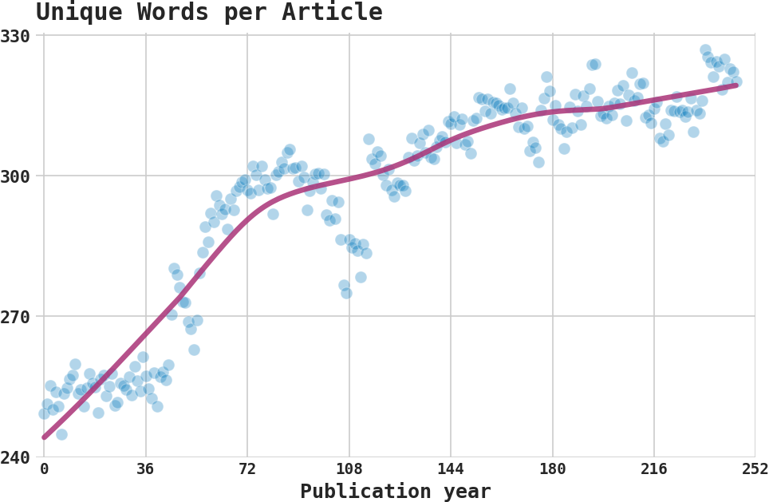

# Readable News: Readability of News Over Time

Has the news become more readable over time? We use the [NYT Corpus](https://github.com/notnews/nytimes-corpus-extractor) and the [Top 10! News Corpus](https://github.com/notnews/top10) to assess how the complexity of news articles has evolved over time. 

We use the [Python package textstat](https://pypi.org/project/textstat/) to estimate where each article lies on the Flesch Reading Ease scale, Flesch-Kincaid Grade Level Scale, The Fog Scale, and the SMOG scale, along with the number of words, and such.

### What we find
1. We use simple methods in computational linguistics to characterize NYT articles.
While the average NYT article length has increased over time, so has readability and lexical richness. Uinsg alternative measures of readability and lexical richness lead to similar findings.

    * Average NYT article length has increased over the years to 550 words in 2007 (an average reading time of 2–3 minutes):

    

    * Average NYT article unique number of words used has also increased over time:

    

    
    * Comovement of wordcount and unique wordcount:
    
    

2. Our main measure of readability is the [Flesch Reading-Ease measure](https://en.wikipedia.org/wiki/Flesch%E2%80%93Kincaid_readability_tests). This measure is inversely related to the average number of syllables per word and the average number of words per sentence. A higher measure indicates higher ease of reading. A higher measure indicates higher ease of reading.

    * Our figure below shows an increase in readability from 1987 till the turn of the millennium by about 10 points. 
This increase is non-trivial since a 10-point gap in Flesch reading ease can separate US grades.
At the end of our sample, the average NYT article has a level of readability that is considered plain English: easily understandable for 13- to 15-year-old students.

    

    
    * We get similar findings using the [SMOG](https://en.wikipedia.org/wiki/SMOG) (Simple Measure of Gobbledygook) readability index. This measure depends on the number of sentences and polysyllabic words. The higher the numbers, the less readable. 
    
    

3. Our main measure for the lexical richness (also called [lexical diversity](https://en.wikipedia.org/wiki/Lexical_diversity)) of the average NYT article is the MTLD ([Measure of Lexical Diversity (McCarthy 2005, McCarthy and Jarvis 2010)](https://github.com/lsys/lexicalrichness)). 
MTLD measures lexical richness using the mean length of sequential words in a text that can maintain a minimal level of type-token ratio (TTR, also known as text-type ratio). This ratio is simply the number of unique words divided by total words. A higher value indicates higher lexical richness.

    * We find an increase in lexical richness for the average NYT article, with the uptrend persisting towards the end of our sample in 2007. We deem the 40% increase over 21 years as non-trivial.
    
    

    * An alternative measure is simply the TTR (type-token ratio). The benefit of this measure is that it's intuitive where the MTLD is less so but more robust to varying text lengths. Both suggest an increase in lexical richness.
    
    

