# Unreadable News: How Readable is American News?

"[M]ore than half of Americans between the ages of 16 and 74 (54%) read below the equivalent of a sixth-grade level."

https://apmresearchlab.org/10x-adult-literacy

Are these low levels of reading comprehension a barrier to becoming politically informed? To shed light on the concern, we estimate the readability of news produced by prominent outlets: [The New York Times](https://github.com/notnews/nytimes-corpus-extractor),  [CNN](https://github.com/notnews/cnn_transcripts), [NPR](https://github.com/zcgzcgzcg1/MediaSum/tree/main/data), and [MSNBC](https://dataverse.harvard.edu/dataset.xhtml?persistentId=doi%3A10.7910%2FDVN%2FUPJDE1).

### NYT is the least readable

The NYT has the lowest readability score of the four outlets, with readers needing a high school education or more to read the average article. NYT also uses more unique terms. Even so, the readability of NYT articles has increased slightly while the other three news outlets (CNN, NPR, MSNBC) have either remained as readable or become slightly worse over time. The trend in NYT's readability suggests they feel competition from alternative news sources, both traditional and non-traditional. Our findings suggest NYT is striving to increase accessibility while maintaining its key demographic of college-educated Americans.

### Data and Methods

NYT article data is available for 1987&ndash;2007 (21 years):

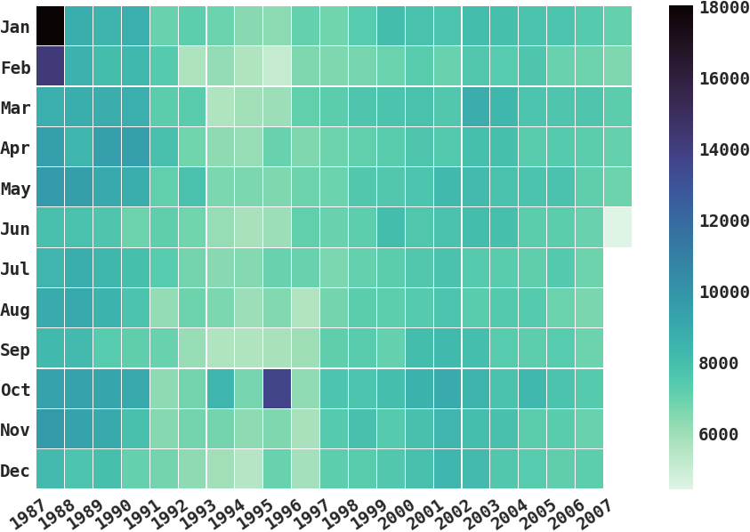

At a finer resolution, we can see that the Sunday newspaper has more articles than the weekday editions, and increasingly so. Below is a plot for two full years of NYT data coverage:

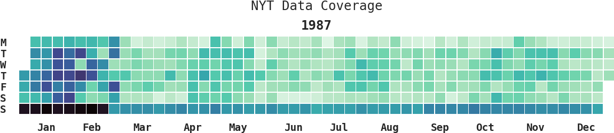

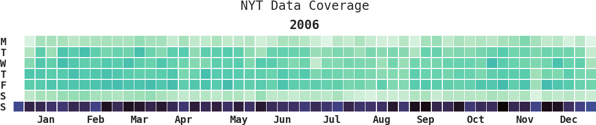

Before computing readability and lexical richness scores, we drop articles over the 99th percentile in text length and below the 1st percentile in text length or articles with fewer than 100 words, whichever is lower. We use the [Python package py-readability-metrics](https://pypi.org/project/py-readability-metrics/) to estimate where each article lies on the Flesch Reading Ease scale, Flesch-Kincaid Grade Level Scale, The Fog Scale, and the SMOG scale, along with the number of words, and such. We also use the [Python package LexicalRichness](https://pypi.org/project/lexicalrichness/) to estimate lexical richness.

### What we find

1. While the average NYT article length has increased over time, so has the readability and the lexical richness. Using alternative measures of readability and lexical richness doesn't change the substantive results.

    * The average length of an article has increased over the years from ~550 words to ~675 words (an average reading time of 2–3 minutes) in 2007:
      

        
<em>Figure notes</em>

         <em>Each marker is an average of NYT articles for each month-year. The red line is a LOWESS (locally weighted scatterplot smoothing) with a generous smoothing          bandwidth.</em>
      

    
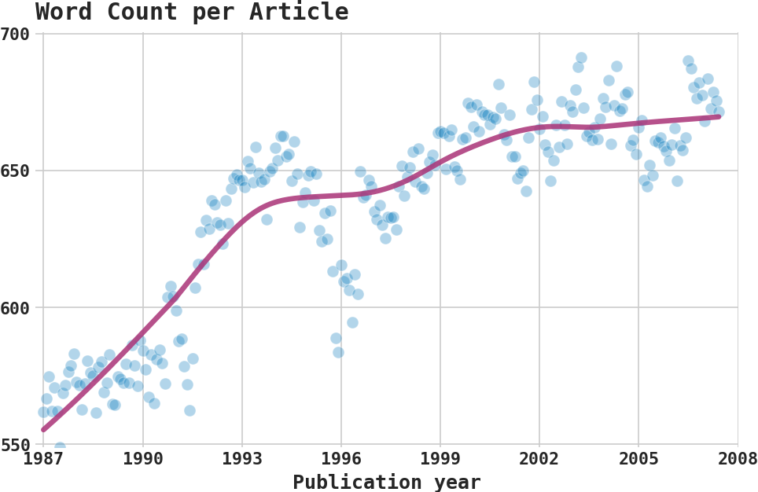

      * The number of words in an article in NYT has also increased over time:
      

        
<em>Figure notes</em>

        <em>Each marker is an average of NYT articles for each month-year. The red line is a LOWESS (locally weighted scatterplot smoothing) with a generous smoothing bandwidth.</em>
      

    
    * Word count and the number of unique words per article move together over time. Does this mean the lexical richness of NYT articles has remained steady over time? Our results on lexical richness below suggest a steady increase in lexical richness.
      

        
<em>Figure notes</em>

        <em>Each marker is an annual average of NYT articles. Both lines are indexed to 1987—the first year of our sample—so that each subsequent marker indicates annual percentage change since the base year of 1987.</em>
      
    
    
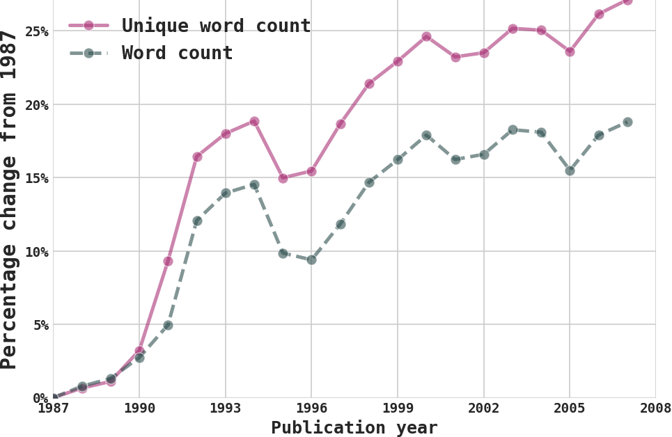

2. Our main measure of readability is the [Flesch Reading-Ease measure](https://en.wikipedia.org/wiki/Flesch%E2%80%93Kincaid_readability_tests). This measure is inversely related to the average number of syllables per word and the average number of words per sentence. A higher score indicates greater ease of reading. 

    * The figure below shows that between 1987 and the turn of the millennium, readability increased by 4 points. To get a sense of the rise, a 10-point gap in Flesch reading ease can separate US grades. At the end of our sample, the average NYT article has a level of readability that is considered fairly difficult: a level understandable for 10th&ndash; 12th-grade students.
      

        
<em>Figure notes</em>

        <em>Each marker is an average of NYT articles for each month-year. NYT articles with word count in the top and bottom one percentile are dropped. The red line is a LOWESS (locally weighted scatterplot smoothing) with a generous smoothing bandwidth.</em>
      

      
    
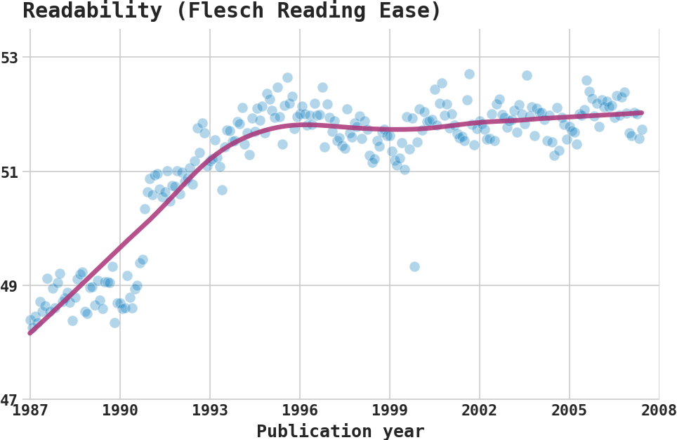

    
    * We get similar findings using the [SMOG](https://en.wikipedia.org/wiki/SMOG) (Simple Measure of Gobbledygook) readability index. This measure depends on the number of sentences and polysyllabic words. The higher the number, the less readable the text. 
      

        
<em>Figure notes</em>

        <em>Each marker is an annual average of NYT articles. NYT articles with word count in the top and bottom one percentile are dropped. Both lines are indexed to 1987—the first year of our sample—so that each subsequent marker indicates annual percentage change since the base year of 1987.</em>
      
    
      
    
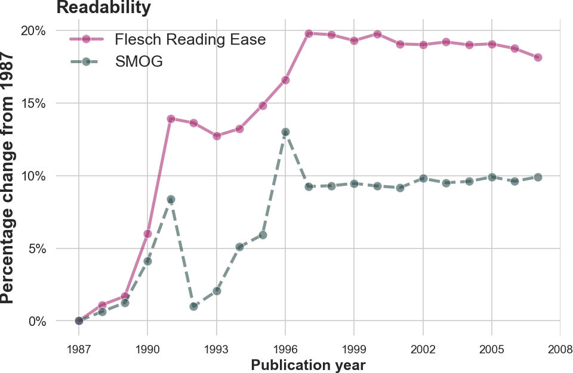

3. Our main measure for the lexical richness (also called [lexical diversity](https://en.wikipedia.org/wiki/Lexical_diversity)) of the average NYT article is the MTLD ([Measure of Lexical Diversity (McCarthy 2005, McCarthy and Jarvis 2010)](https://github.com/lsys/lexicalrichness)). 
MTLD measures lexical richness using the mean length of sequential words in a text that can maintain a minimal level of type-token ratio (TTR, also known as text-type ratio). This ratio is simply the number of unique words divided by total words. A higher value indicates greater lexical richness.

    * In NYT, average lexical richness increased by over 40% in 21 years.
      

        
Figure notes

        <em>Each marker is an average of NYT articles for each month-year. NYT articles with word count in the top and bottom one percentile are dropped. The red line is a LOWESS (locally weighted scatterplot smoothing) with a generous smoothing bandwidth.</em>
      
    
      
    
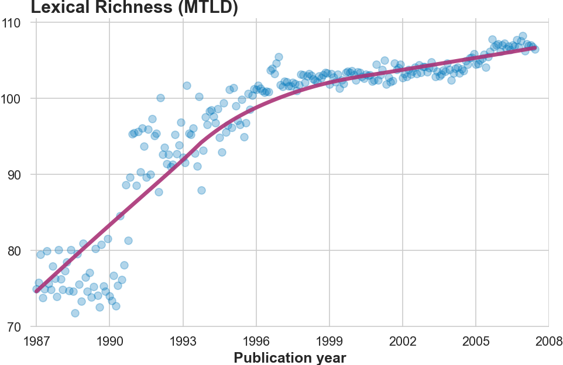

    * An alternative measure is simply the TTR (type-token ratio). The benefit of this measure is that it's intuitive. Both suggest an increase in lexical richness.
      

        
<em>Figure notes</em>

        <em>Each marker is an annual average of NYT articles. NYT articles with word count in the top and bottom one percentile are dropped. Both lines are indexed to 1987—the first year of our sample—so that each subsequent marker indicates annual percentage change since the base year of 1987.</em>
      
    
      
    
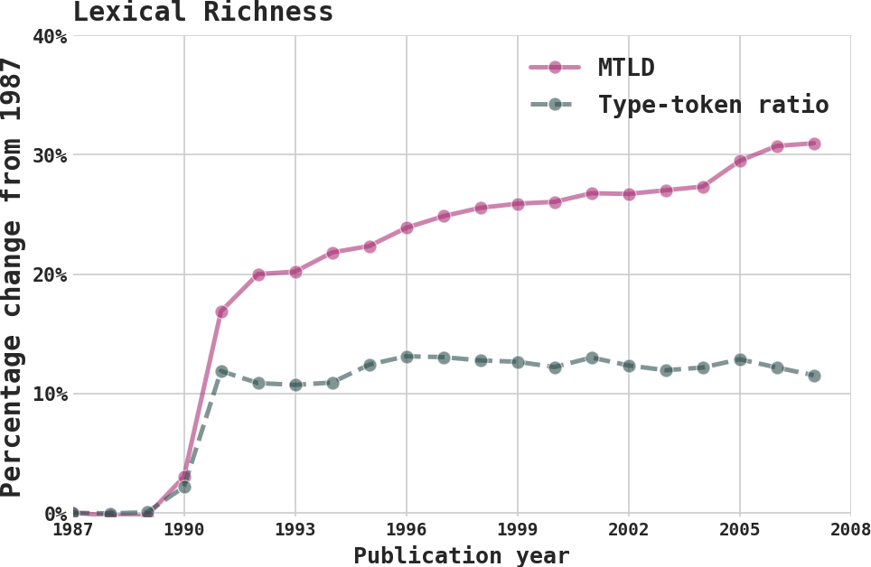

4. Using data for three other outlets (CNN 2001&ndash;2022, NPR 2005&ndash;2019, and MSNBC 2003&ndash;2021), we see that NYT is the least readable while being the most lexically rich. For instance, NYT has an average of ~50 while CNN has an average of ~70 for the Flesch reading ease score. This 20-point difference is stark. A score of 50 is at the more readable tail of the US college level ((50&ndash;30)), which is the key NYT demographic. A score of ~70, on the other hand, is at the more readable tail of the 8th&ndash;9th grade in US school level reading level (70&ndash;60). In other words, the difference in readability between NYT and CNN is years of education.

  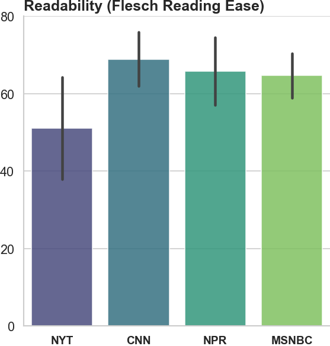
&nbsp; &nbsp; &nbsp; &nbsp;
  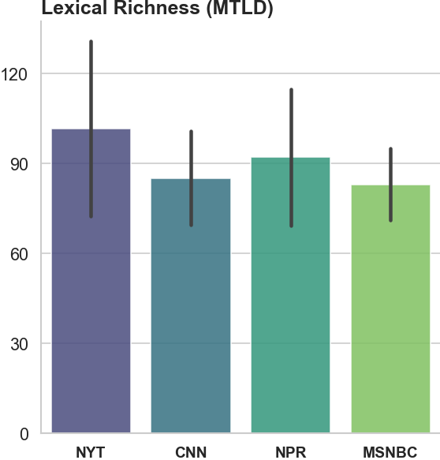

